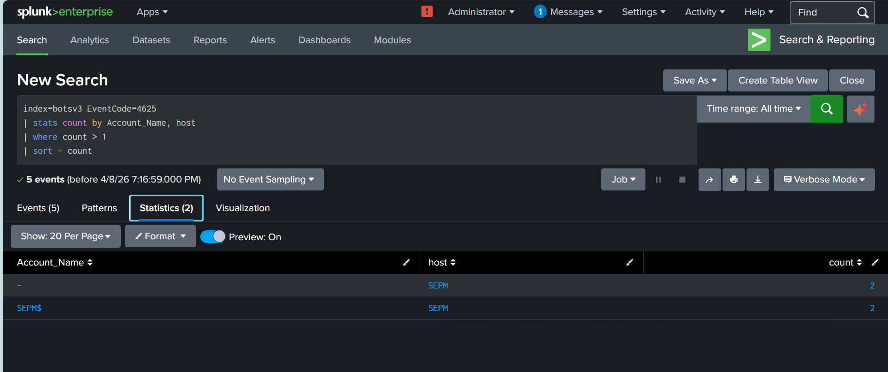
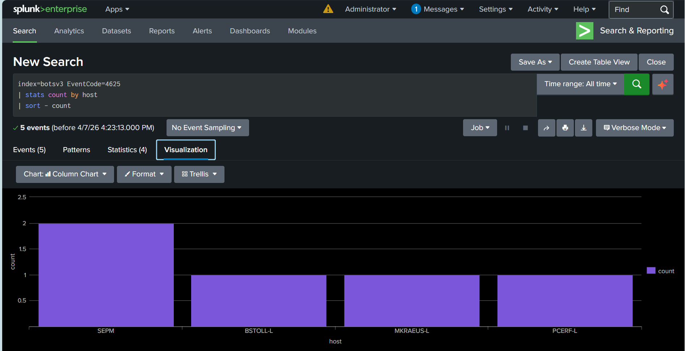
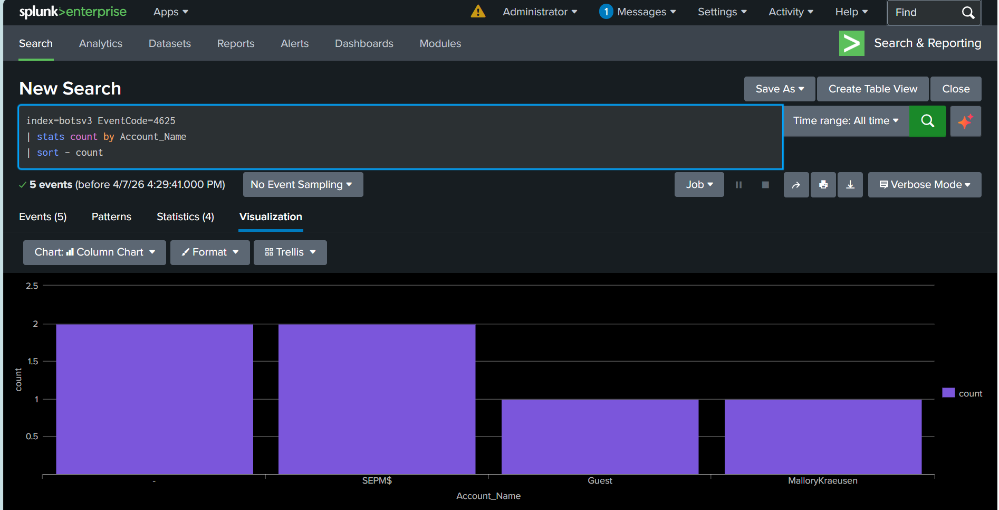
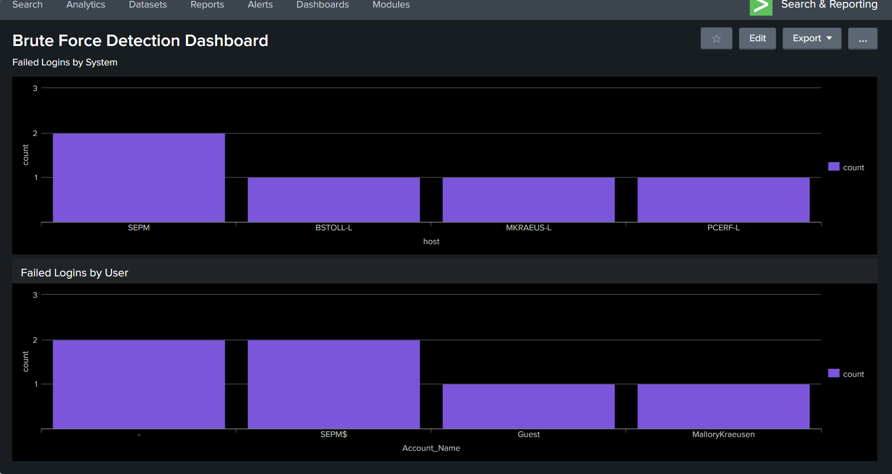
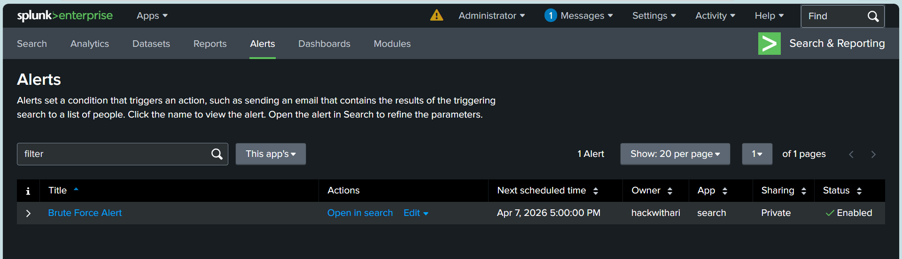

# Brute-Force Attack Detection using Splunk

## Overview

This project demonstrates the use of Splunk to detect brute-force attacks by analyzing Windows Event Logs. It focuses on identifying abnormal authentication behavior through repeated failed login attempts within a defined time window.

## Objectives

* Detect unauthorized login attempts
* Identify brute-force attack patterns
* Analyze Windows Event Logs (EventCode 4625)
* Build a monitoring dashboard and alerting system

## Tech Stack

* Splunk Enterprise
* Bots v3 Dataset
* Windows Event Logs

## Detection Logic

The detection approach is based on time-based correlation of failed login events:

* Monitored failed login events (EventCode 4625)
* Applied threshold: more than 5 failed attempts within 5 minutes
* Identified patterns indicating suspicious authentication activity

This method helps reduce false positives by considering both frequency and time intervals.

## Key Features

### System Analysis

* Identifies hosts with the highest number of failed login attempts
* Helps detect systems that may be targeted during an attack

### User Analysis

* Tracks user accounts with repeated login failures
* Highlights commonly targeted accounts

### Dashboard

* Visual representation of login failure patterns
* Combines system-level and user-level insights
* Enables quick identification of anomalies

### Alert System

* Triggers alerts when defined thresholds are exceeded
* Supports near real-time detection of suspicious activity

---

## Screenshots

### Detection Result


### System Analysis


### User Analysis


### Dashboard


### Alert System


## Project Structure

```
brute-force-detection-splunk/
│
├── queries/        # Splunk detection queries
├── screenshots/    # Dashboard and analysis visuals
├── report/         # Project documentation (PDF)
└── README.md
```

---

## Sample Splunk Query

```
index=botsv3 EventCode=4625
| stats count by Account_Name, host
| where count > 5
```

## Conclusion

This project demonstrates how brute-force attacks can be detected using log analysis and SIEM tools. It highlights the importance of monitoring authentication events, applying threshold-based detection, and enabling real-time alerting.

## Future Improvements

* Implement machine learning-based anomaly detection
* Integrate threat intelligence feeds
* Automate incident response workflows

## Author

Harini Mohan
